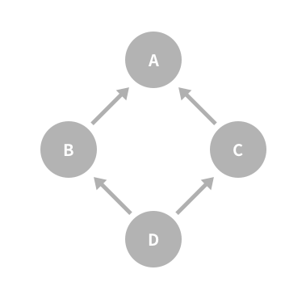
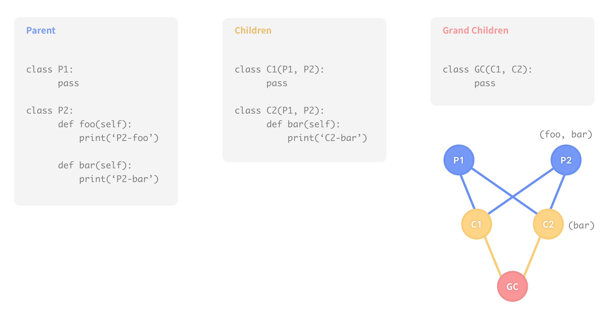
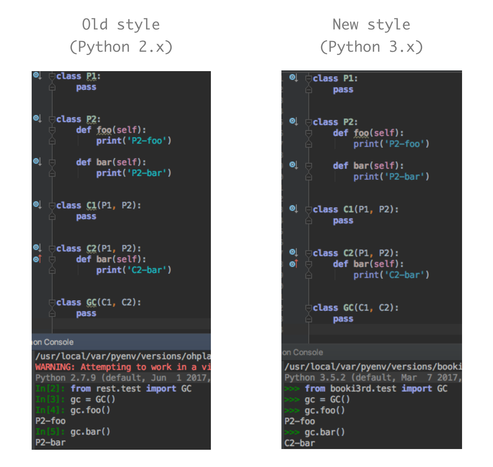
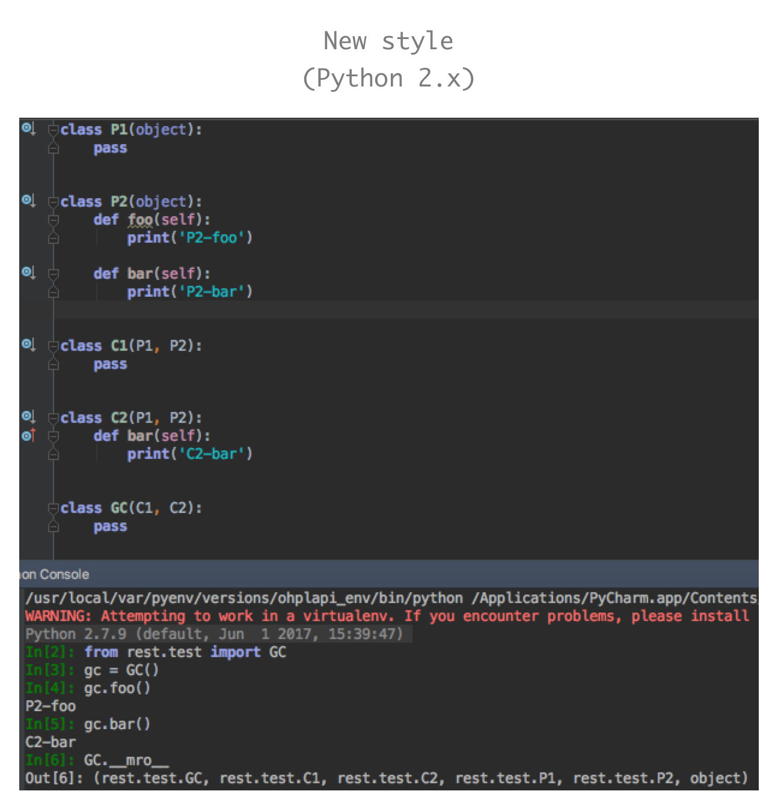
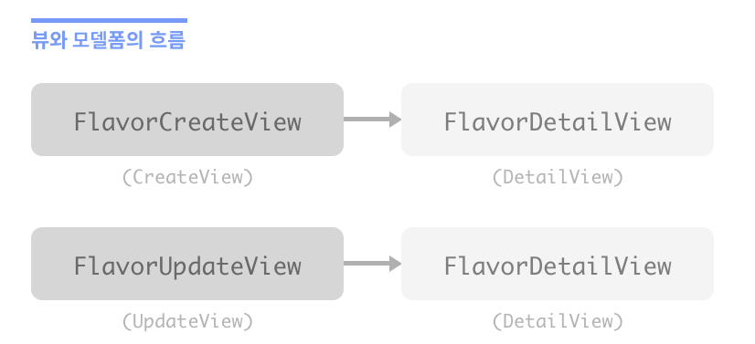
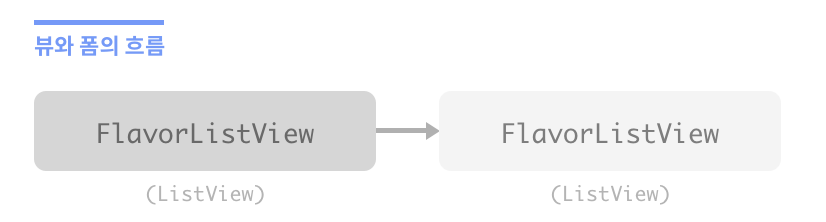

# 클래스 기반 뷰의 모범적인 이용

### django의 view 
요청 객체를 받고 응답 객체를 반환하는 내장 함수

### 함수 기반 뷰
뷰 함수 자체가 내장 함수

### 클래스 기반 뷰
뷰 클래스는 내장 함수를 반환하는 as_view() 클래스 메서드를 제공한다.  
django.views.generic.View 에서 아래와 같은 매커니즘이 구현되고, 모든 클래스 기반 뷰는 이 클래스를 직간접적으로 상속받아 이용한다. 

- as_view()에서 클래스의 인스턴스를 생성 
- 인스턴스의 dispatch() 메서드 호출
- dispatch() 메서드에서 HTTP GET/POST 메서드를 알아냄
- 인스턴스 내 해당 메서드로 중개를 한다
- 메서드가 정의되어 있지 않으면 HttpResponseNotAllowed 예외 발생

### 제네릭 클래스 기반 뷰
장고는 대부분의 웹 프로젝트에서 공통적으로 사용되는 부분을 추상화하여 제네릭 클래스 기반 뷰로 제공한다. 

#### django-braces 라이브러리
[django-braces Document](https://django-braces.readthedocs.io/en/latest/)
> **장고의 제네릭 클래스 기반 뷰에서 빠진 부분**  
> 장고의 기본형에는 제네릭 클래스 기반 뷰를 위한 중요한 믹스인들이 빠져있다. (eg.Authentication)  
> `django-braces` 라이브러는 제네릭 클래스 기반 뷰를 쉽고 빠르게 개발하기 위한 명확한 믹스인들을 제공한다.

## 10.1 클래스 기반 뷰를 이용할 때의 가인드라인
- 뷰 코드의 양은 적으면 적을수록 좋다.
- 뷰 안에서 같은 코드를 반복적으로 이용하지 말자.
- 뷰는 프레젠테이션 로직에서 관리하도록 하자. 비지니스 로직은 모델에서 처리하자. 매우 특별한 경우에는 폼에서 처리하자.
- 뷰는 간단 명료해야한다.
- 403, 404, 500 에러 핸들링에 클래스 기반 뷰는 이용하지 않는다. 대신 함수 기반 뷰를 이용하자.
- 믹스인은 간단 명료해야한다.

## 10.2 클래스 기반 뷰와 믹스인 이용하기
### 믹스인
실체화된 클래스가 아닌, 상속해 줄 기능들을 제공하는 클래스를 의미한다.  
다중 상속을 해야 할 때, 믹스인을 사용하면 클래스에 더 나은 역할과 기능을 제공할 수 있다.

> 실체화 = 인스턴스화(instantiation)  
> 클래스의 객체에 대해 메모리를 할당하여 인스턴스를 만드는 것

#### 상속에 관한 규칙
케네스 러브(Kenneth Love)가 제안한 상속에 관한 규칙을 이용하자.  
이는 파이썬의 메서드 처리 순서(MRO)에 기반을 둔 것으로, 왼쪽에서 오른쪽의 순서로 처리한다고 표현할 수 있다.

- **규칙1.** 장고가 제안하는 기본 뷰는 '항상' 오른쪽으로 진행한다.  
- **규칙2.** 믹스인은 기본 뷰에서부터 왼쪽으로 진행한다.  
- **규칙3.** 믹스인은 파이썬의 기본 객체 타입을 상속해야만 한다.

#### 예제

~~~python 
from django.views.generic import TemplateView

class FreshFruitMixin(object):

	def get_context_data(self, **kwargs):
		context = super(FreshFruitMixin, self).get_context_data(**kwargs)
		context['has_fresh_fruit'] = True
		return context

class FruityFlavorView(FreshFruitMixin, TemplateView):
	template_name = 'fruity_flavor.html'
~~~

FruityFlavorView 클래스는 FreshFruitMixin과 TemplateView를 상속하고있다.

- **규칙1.** TemplateView는 장고에서 제공하는 기본 클래스이기 때문에 가장 오른쪽에 위치한다.  
- **규칙2.** FreshFruitMixin은 TemplateView 왼쪽에 위치한다.
- **규칙3.** FreshFruitMixin은 object를 상속하고 있다.

### super()
- super() 함수는 슈퍼클래스의 메서드를 호출하는 함수이다.  
- 다수의 슈퍼클래스가 존재한다면 MRO를 통해 호출 순서를 결정한다. 

~~~python
# 부모 클래스의 메서드를 사용하고 싶은 경우 

class Icecream:
	def __init__(self, name, flavor):
		self.name = name
		self.flavor = flavor

	def info(self):
		print('이름 : ', self.name)
		print('맛 :', self.flavor)

class New(Icecream):
	def __init__(self, name, flavor, topping):
		super().__init__(name, flavor)
		self.topping = topping
    
	def info(self):
		super().info()
		print('토핑: ', self.topping)
~~~

~~~
>>> order = New('CHORRY', 'Strawberry', 'Chocolate')
>>> order.info()
이름: CHORRY
맛: Strawberry
토핑: Chocolate
~~~

위와 같은 형태의 다중 상속이 이루어지는 경우, 최상위 클래스인 A를 두 번 호출하게 된다. 

~~~python
# 다중 상속으로 인해 최상위 클래스가 중복 호출되는 경우

class A:
	def __init__(self):
		print('A')
		
class B(A):
	def __init__(self):
		print('B')
		A.__init__(self)
		

class C(A):
	def __init__(self):
		print('C')
		A.__init__(self)
		

class D(B, C):
	def __init__(self):
		print('D')
		B.__init__(self)
		C.__init__(self)	
~~~

~~~
>>> obj = D()
D
B
A
C
A
~~~
이 경우 super() 함수로 해결할 수 있다.   
클래스 D는 다중상속 받고 있으므로 `__mro__`에 의해 호출 순서가 결정된다.

~~~python
class A:
	def __init__(self):
		print('A')
		
class B(A):
	def __init__(self):
		print('B')
		super().__init__()

class C(A):
	def __init__(self):
		print('C')	
		super().__init__()

class D(B, C):
	def __init__(self):
		print('D')
		super().__init__()		
~~~

~~~
>>> obj = D()
D
B
C
A
>>>D.__mro__
(__main__.D, __main__.B, __main__.C, __main__.A, object)
~~~

### MRO | Method Resolution Order
MRO는 다중 상속을 가진 클래스에서 사용할 올바른 메소드를 찾기 위해 Python에서 사용하는 클래스 검색 경로를 정의하는 것이다.

#### Old style And New style

  

  
**python 2.x 에서 새로운 알고리즘을 사용하는 방법**  
부모 클래스가 파이썬의 기본 객체를 상속받는다는 것을 명시한다. 

> 1. python3 에서는 각 클래스가 기본적으로 파이썬의 기본 객체 `object`를 상속하기 때문에 명시하지 않아도 된다.  
> 2. `model.__mro__` 또는 `model.mro()`를 사용하면 어떤 경로로 메소드를 찾고 있는지 확인할 수 있다. (new style에서만 적용됨)  

#### Impossible Method Resolution

~~~python
class P1:
	pass

class P2:
	pass

class C1(P1, P2):
	pass

class C2(P2, P1):
	pass
	
class GC(C1, C2):
	pass
~~~

~~~
TypeError: Cannot create a consistent method resolution
order (MRO) for bases P1, P2
~~~

> 출처  
> [Method Resolution Order](https://www.youtube.com/watch?v=BQiQoAYsUFw&t=345s)  
> [Pycon2016-MRO 영상](https://www.youtube.com/watch?v=cuonAMJjHow&feature=youtu.be)  
> [Understanding Python MRO](https://makina-corpus.com/blog/metier/2014/python-tutorial-understanding-python-mro-class-search-path)

## 10.3 어떤 장고 제네릭 클래스 기반 뷰를 어떤 태스크에 이용할 것인가?
제네릭 클래스 기반 뷰의 장점은 단순화를 희생해서 얻은 결과다.  
제네릭 클래스 기반 뷰는 최대 8개의 슈퍼클래스가 상속되기도 하는 복합적인 상속 체인이다.

### django.views.generic.View

- Base views
	- View
	- TemplateView
	- RedirectView

- Generic display views
	- DetailView
	- ListView

- Generic editing views
	- FormView
	- CreateView
	- UpdateView
	- DeleteView

- Generic date views
	- ArchiveIndexView
	- YearArchiveView
	- MonthArchiveView
	- WeekArchiveView
	- DayArchiveView
	- TodayArchiveView
	- DateDetailView

### django.contrib.auth.views  
django 1.11에서 사용할 수 있다. 

- LoginView
- LogoutView
- PasswordChangeDoneView
- PasswordChangeView
- PasswordResetCompleteView
- PasswordResetConfirmView
- PasswordResetDoneView
- PasswordResetView

### 장고 클래스 기반 뷰의 이용 표

| 이름 | 목적 |
| --- | --- |
| View | 어디에서든 이용 가능한 기본 뷰 | 
| RedirectView | 사용자를 다른 URL로 리다이렉트 | 
| TemplateView | 장고 HTML 템플릿을 보여줄 때  | 
| ListView | 객체 목록 | 
| DetailView | 객체를 보여줄 때 | 
| FormView | 폼 전송 | 
| CreateView | 객체를 만들 때 | 
| UpdateView | 객체를 업데이트 할 때 | 
| DeleteView | 객체를 삭제 | 
| generic date view | 시간 순서로 객체를 나열해 보여줄 때 | 

### 장고 클래스 기반 뷰/제네릭 클래스 기반 뷰의 이용에 대한 세 가지 의견
#### 1. 제네릭 뷰의 모든 종류를 최대한 이용하자
작업양을 최소화 하기 위해 제네릭 뷰가 제공하는 모든 종류의 뷰를 최대한 이용하기를 장려한다.
#### 2. 심플하게 django.views.generic.View 하나로 모든 뷰를 처리하자 
장고의 기본 클래스 뷰로도 충분히 원하는 기능을 소화할 수 있다.   
진정한 클래스 기반 뷰란 모든 뷰가 제네릭 클래스 기반 뷰이어야 한다.  
1번의 리소스 기반 접근 방식이 실패한 난해한 태스크에 대해서 효율적이다.
> 10.6 참고

#### 3. 뷰를 정말 상속할 것이 아닌 이상 그냥 무시하자
읽기 쉽고 이해하기 쉬운 FBV로 시작하고, 반드시 필요한 경우에만 CBV를 이용하자.

## 10.4 장고 클래스 기반 뷰에 대한 일반적인 팁
장고의 클래스 기반 뷰와 제네릭 기반 뷰는 뷰, 템플릿 그리고 뷰와 템플릿에 대한 테스트를 신속하게 제작하는 데 그 목적이 있다. 

### 10.4.1 인증된 사용자에게만 장고 클래스 기반 뷰/제네릭 클래스 기반 뷰 접근하게 하기

~~~python
from django.views.generic import DetailView

from braces.views import LoginRequiredMixin

from .models import Flavor

class FlavorDetailView(LoginRequiredMixin, DetailView):
	model = Flavor
~~~
> **제네릭 클래스 기반 뷰 믹스인 순서를 명심하자**
> 
> LoginRequiredMixin은 가장 왼쪽에 위치한다.
> 베이스 뷰 클래스는 항상 가장 오른쪽에 위치한다.

### 10.4.2 뷰에서 유효한 폼을 이용하여 커스텀 액션 구현하기
뷰에서 폼의 유효성 검사(valid form)를 할 때 커스텀 액션을 구현하고자 한다면, form_valid()는 제네릭 클래스 기반 뷰가 요청을 보내는 곳에 위치한다.

~~~python
from django.views.generic import CreateView

from braces.views import LoginRequiredMixin

from .models import Flavor

class FlavorCreateView(LoginRequiredMixin, CreateView):
	models = Flavor
	fields = ('title', 'slug', 'scoops_remaining')
	
	def form_valid(self, form):
	# 커스텀 로직이 이곳에 위치
		return super(FlavorCreateView, self).form_valid(form)
~~~
form_valid()의 반환형: `django.http.HttpResponseRedirect`

### 10.4.3 뷰에서 부적합한 폼을 이용하여 커스텀 액션 구현하기 
뷰에서 폼의 부적합성 검사(invalid form)를 할 때 커스텀 액션을 구현하고자 한다면, form_invalid()는 제네릭 클래스 기반 뷰가 요청을 보내는 곳에 위치한다. 이 메서드는 django.http.HttpResponse를 반환한다.

~~~python
from django.views.generic import CreateView

from braces.views import LoginRequiredMixin

from .models import Flavor

class FlavorCreateView(LoginRequiredMixin, CreateView):
	models = Flavor
	
	def form_invalid(self, form):
	# 커스텀 로직이 이곳에 위치
		return super(FlavoerCreateView, self).form_invalid(form)
~~~

form\_valid()에서 로직을 추가했던 것과 같은 방법이다.
form\_valid(), form_invalid() 메서드를 오버라이딩 하는 예는 `11.5.1 모델폼 데이터는 폼에 먼저 저장된 이후 모델 인스턴스에 저장된다` 에서 다룬다.

### 10.4.4 뷰 객체 이용하기 
콘텐츠를 렌더링하는 것에 클래스 기반 뷰를 이용한다면 자체적인 메서드와 속성을 제공하는 뷰 객체를 이용해 다른 메서드나 속성에서 호출이 가능하다.

~~~python
from django.utils.functional import cached_property
from django.views.generic import UpdateView, TemplateView

from braces.views import LoginRequiredMixin

from .models import Flavor
from .tasks import update_users_who_favorited

class FavoriteMixin(object):

	@cached_property
	def likes_and_favorites(self):
		likes = self.object.likes()
		favorites = self.object.favorites()
		return {
			"likes": likes,
			"favorites": favorites,
			"favorites_count": favorites.count()
			}
	

class FlavorUpdateView(LoginRequiredMixin, FavoriteMixin, UpdateView):
	model = Flavor
	fields = ('title', 'slug', 'scoops_remaining')
	
	def form_valid(self, form):
		update_users_who_favorited(
			instance=self.object,
			favorites=self.likes_and_favorites['favorites']
			)
		return super(FlavorCreateView, self).form_valid(form)
		
		
class FlavorDetailView(LoginRequiredMixin, FavoriteMixin, TemplateView):
	model = Flavor
~~~

다양한 flavors/ 앱 템플릿에서 해당 속성을 호출할 수 있다는 장점이 있음

~~~html
{# flavors/base.html #}
 


<ul>
	<li>Likes: {{ view.likes_and_favorites.likes }}</li>
	<li>Favorites: {{ view.likes_and_favorites.favorites_count }}</li>
</ul>

~~~

## 10.5 제네릭 클래스 기반 뷰와 폼 사용하기

예제에 사용할 아이스크림 종류 모델 정의

~~~python
# flavor/models.py
from django.core.urlresolvers import reverse
from django.db import models

STATUS = (
	(0, "zero"),
	(1, "one"),
)

class Flavor(models.Model):
	title = models.CharField(max_length=255)
	slug = models.SlugField(unique=True)
	scoops_remaining = models.IntegerField(defualt=0, choices=STATUS)
	
	def get_absolute_url(self):
		return reverse("flavors:detail", kwargs={"slug": self.slug})
~~~

### 10.5.1 뷰 + 모델폼 예제
- 가장 단순하고 일반적인 장고 폼 시나리오
- 모델 생성 후, 모델에 새로운 레코드를 추가하거나 기존 레코드를 수정하는 기능

View | 기능 | 상속 
--- | --- | ---
FlavorCreateView | 새로운 종류의 아이스크림을 추가하는 폼 | CreateView
FlavorUpdateView | 기존 아이스크림을 수정하는 폼 | UpdateView
FlavorDetailView | 아이스크림 추가와 변경을 확정하는 폼 | DetailView

> naming convention 을 최대한 따르자

~~~python
# flavors/views.py
from django.views.generic import CreateView, UpdateView, DetailView

from braces.views import LoginRequiredMixin

from .models import Flavor

class FlavorCreateView(LoginRequiredMixin, CreateView):
	model = Flavor
	fields = ('title', 'slug', 'scoops_remaining')
	
class FlavorUpdateView(LoginRequiredMixin, UpdateView):
	model = Flavor
	fields = ('title', 'slug', 'scoops_remaining')
	
class FlavorDetailView(DetailView):
	model = Flavor
~~~

위와 같은 상황에서 발생하는 문제: **FlavorDetailView가 확인 페이지가 아니다.**  
django.contrib.messages를 이용하여 사용자가 아이스크림을 추가하거나 변경했다는 것을 FlavorDetailView에 알릴 수 있다.

~~~python
# flavors/views.py
from django.contrib import messages
from django.views.generic import CreateView, UpdateView, DetailView

from braces.views import LoginRequiredMixin

from .models import Flavor

class FlavorActionMixin(object):

	fields = ('title', 'slug', 'scoops_remaining')
	
	@property
	def success_msg(self):
		return NotImplemented
	
	def form_valid(self, form):
		messages.info(self.request, self.success_msg)
		return super(FlavorActionMixin, self).form_valid(form)
		

class FlavorCreateView(LoginRequiredMixin, FlavorActionMixin, CreateView):
	model = Flavor
	success_msg = "Flavor created!"
	
	
class FlavorUpdateView(LoginRequiredMixin, FlavorActionMixin, UpdateView):
	model = Flavor
	success_msg = "Flavor updated!"
	
class FlavorDetailView(DetailView):
	model = Flavor
~~~

생성 또는 업데이트된 후 메시지 리스트가 FlavorDetailView의 콘텍스트로 전달된다. 
템플릿을 다음과 같이 작성하면, 생성 또는 업데이트 시 메시지를 표시해줄 수 있다.

~~~html
{# templates/flavors/flavor_detail.html #}

	<ul class="messages">
		
			<li id="message_{{ forloop.counter }}"
				 
					class="{{ message.tags }}"
				>
				
				{{ message }}
				
			</li>				
		
	</ul>

~~~

### 10.5.2 뷰 + 폼 예제 
ModelForm이 아니라 장고 Form이 필요한 경우.

예제: 아이스크림 종류 검색 폼  

- 검색문자가 이름에 포함되어 있는 아이스크림 종류를 나열한다.  
- 일반적으로 인터넷에서 쓰이는 관례를 따라 `q`는 검색 쿼리 파라미터를 의미한다.  
- 추가/삭제를 처리하는 폼이 아니기 때문에 GET요청을 이용한다.

~~~python
from django.views.generic import ListView

from .models import Flavor

class FlavorListView(ListView):
	model = Flavor
	
	def get_queryset(self):
		# 부모 get_queryset으로부터 쿼리셋을 패치
		queryset = super(FlavorListView, self).get_queryset()
		
		# q GET 파라미터 받기
		q = self.request.GET.get("q")
		if q:
			# 필터된 쿼리셋 반환
			return queryset.filter(title__icontains=q)

		# 기본 쿼리셋 반환
		return queryset
~~~

검색 폼은 다음과 같이 구성된다.

~~~html
{# templates/flavors/_flavor_search.html #}

	Usage: 


<form action="" method="GET">
	<input type="text" name="q" />
	<button type="submit">search</button>
</form>
~~~

## 10.6 django.views.generic.View 이용하기 
모든 뷰에서 django.views.generic.View만 이용하여 장고 프로젝트를 전부 구성할 수도 있다.   

> 참고: [장고 공식문서 - 클래스 기반 뷰 소개](https://docs.djangoproject.com/en/1.11/topics/class-based-views/intro/#using-class-based-views)

각 HTTP 메서드를 중첩된 if 문으로 처리하는 함수 기반 뷰를 작성하거나  
get_context_data()와 form_valid() 메서드 뒤에 숨어있는 HTTP 메서드들이 위치한 클래스 기반 뷰를 작성하는 대신, 이 메서드들에 직접 접근할 수 있다면?

~~~python
from django.shortcuts import get_object_or_404
from django.shortcuts import render, redirect
from django.views.generic import View

from braces.views import LoginRequiredMixin

from .forms import FlavorForm
from .models import Flavor

class FlavorView(LoginRequiredMixin, View):
	def get(self, request, *args, **kwargs):
		# Flavor 객체의 디스플레이를 처리
		flavor = get_object_or_404(Flavor, slug=kwargs['slug'])
		return render(request, "flavors/flavor_detail.html", {"flavor":flavor})
	
	def post(self, request, *args, **kwargs):
		# Flavor 객체의 업데이트를 처리
		flavor = get_object_or_404(Flavor, slug=kwargs['slug'])
		form = FlavorForm((request.POST)
		if form.is_valid():
			form.save()
		return redirect("flavors:detail", flavor.slug)
~~~

GET 메서드와 함께 JSON, PDF 또는 다른 비HTML 콘텐츠를 서비스하기 위해  
django.views.generic.View클래스를 이용하면 매우 유용하다.  
FBV에서 CSV, 엑셀, PDF 파일을 렌더링하기 위해 이용한 방법들을 GET 메서드를 사용할 때 적용할 수 있다.

~~~python
from django.http import HttpResponse
from django.shortcuts import get_object_or_404

from django.views.generic import View

from braces.views import LoginRequiredMixin

from .models import Flavor
from .reports import make_flavor_pdf

class PDFFlavorView(LoginRequiredMixin, View):
	
	def get(self, request, *args, **kwargs):
		# 종류 할당
		flavor = get_object_or_404(Flavor, slug=kwargs['slug']
		
		# 응답 생성
		response = HttpResponse(content_type='application/pdf')
		
		# PDF 스트림 생성 후 응답에 할당
		response = make_flavor_pdf(response, flavor)
		
		return reponse
~~~

객체 지향의 장점을 살린 클래스 기반 뷰와 함수 기반 뷰를 조합해 이용함으로써 그 장점을 최대한 살릴 수 있다.

## 10.7 추가 참고 자료

- [Django Document : class-based-views](http://docs.djangoproject.com/en/1.11/topics/class-based-views/)
- [Django Document : generic-display](http://docs.djangoproject.com/en/1.11/topics/class-based-views/generic-display/)
- [Django Document : generic-editing](http://docs.djangoproject.com/en/1.11/topics/class-based-views/generic-editing/)
- [Django Document : mixins](http://docs.djangoproject.com/en/1.11/topics/class-based-views/mixins/)
- [Django Document : ref-class-based-views](http://docs.djangoproject.com/en/1.11/ref/class-based-views/)
- [ccbv](http://ccbv.co.uk/)
- [mro](http://www.python.org/download/releases/2.3/mro/)

> **다른 유용한 클래스 기반 뷰 라이브러리들**  
> **django-extra-views** : django-braces가 지원하지 않는 경우를 많이 지원하고 있다.  
> **django-vanilla-views** : 단순 명료함을 기반으로 기본 장고 제네릭 클래스 기반 뷰의 강력한 기능을 제공한다. django-braces와 함께 이용하면 강력한 성능을 발휘할 수 있다.

## 10.8 요약

- 믹스인과 클래스 기반 뷰를 이용하는 방법
- 어떤 작업에 장고의 클래스 기반 뷰가 이용되어야 하는가
- 클래스 기반 뷰 사용에 대한 일반적인 팁들
- 클래스 기반 뷰를 폼에 연동하기
- 베이스 django.view.generic.View 이용하기
