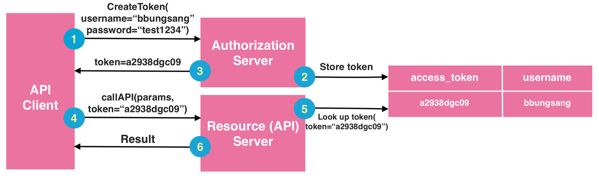
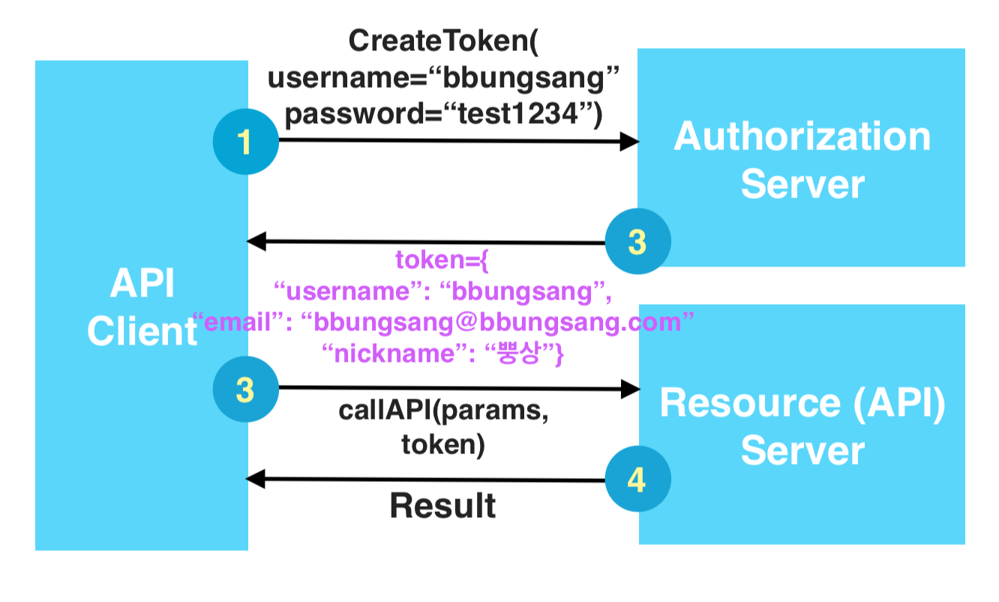
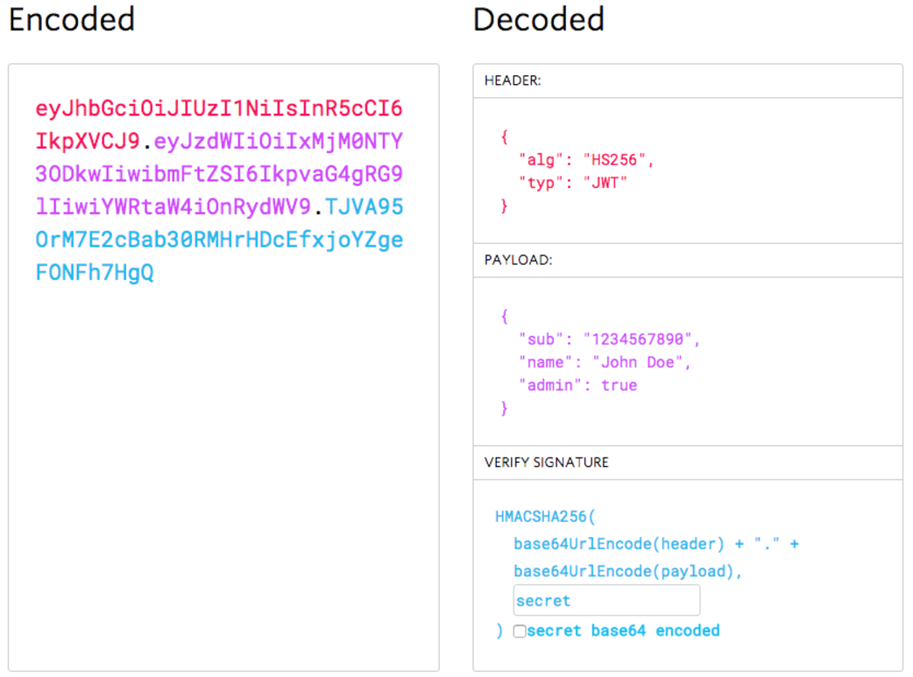

REST API 인증이 핫해지면서 많이 언급되는 것이 `OAuth`인데, 최근에 회자되고 있는 것이 `JWT(JSON Web Token)`이라는 표준이다.

## OAuth 기반 토큰
- OAuth에 의해서 발급되는 `access_token`은 무작위로 나열되는 문자열로, 토큰 자체에는 특별한 정보를 가지고 있지 않다.
- API나 서비스를 제공하는 서버 측에서 해당 토큰을 이용하여 사용자의 권한을 식별한 뒤, 권한을 허용해주는 구조이다.



## Claim 기반 토큰
- Claim은 사용자에 대한 프로퍼티나 속성을 뜻한다.
- 해당 토큰을 이용해서 요청을 받는 서버 입장에서는 서비스를 호출한 사용자에 대한 추가 정보가 이미 토큰 안에 포함돼있기 때문에 다른 곳에서 가져올 필요가 없다.
- 인증 단계에서 토큰을 생성 혹은 조회하여 해당하는 토큰 값을 가져오는 것이 아니고, username, email 등의 `user 정보`를 가져온다.
- 즉 토큰 내에 유저 정보가 존재하기 때문에 토큰을 별도로 서버에서 유지할 필요가 없으며, 사용자 정보를 호출하기 위해 계정 시스템을 거칠 필요가 없다.



## JWT
- JWT는 JSON 객체로서 클라이언트와 서버 간에 안전하게 정보를 전송할 수 있는 작고 독립적인 방법을 정의하는 공개 표준(RFC 7519)이다.
- JWT의 경우 `Claim 기반이라는 방식`을 사용하는데, 토큰 자체가 정보를 가지고 있는 방식으로, JWT는 이 Claim을 `JSON 형태`로 정의한다.
- 하지만 JSON은 '\n' 등의 개행문자가 포함되어 있기 떄문에 Header에 넣기가 불편하다. 따라서 해당 JSON 문자열을 BASE64 인코딩을 통해서 하나의 문자열로 변환해야 한다.

```json
{
	"username": "bbungsang",
	"email": "bbungsang@bbungsang.com",
	"nickname": "뿡상"
}
```

BASE64 인코딩 결과

```docker
EAACcwd4rQBgBAOpQkOqdHp3Iqywfwqky25QnbJe0TJnQQlrB5AferqBq43CXmgrkRIO6yK22DHckc7G3WHUqGSZC9
```

### 왜 사용할까?

- **Reliable** : HMAC 알고리즘 또는 RSA를 사용하는 공개/개인키를 사용하여 서명되었기 때문에 검증되었고 신뢰도가 높다.
- **Compact** : 크기가 작기 때문에 POST 파라미터 혹은 HTTP Header를 통해 전송될 수 있으며 이는 전송이 빠름을 의미한다.
- **Self-contained** : 사용자에 대한 모든 정보가 들어있어 데이터베이스에 두 번 이상 쿼리를 날릴 필요가 없다.

### JWT Structure
JWT는 `.`로 구분된 3개의 Base64 문자열이다.(XML 기반 표준과 비교할 때 더 작아졌다.)

- Header
- Payload
- Signature

`xxxx.yyyy.zzzz`의 형태로 표현된다.

#### Header
헤더는 일반적으로 HMACSHA256 또는 RSA의 해시 알고리즘과 Base64 URL로 인코딩되어 있는 토큰, 두 부분으로 구성된다.

```
{
  "alg": "HS256",
  "typ": "JWT"
}
``` 

#### Payload
Claim이 들어있으며, Claim은 Entity와 추가 메타데이터에 대한 설명으로 Reserved, Public, Private 3가지 유형이 존재한다.

```
{
	"sub": "1234567890",
	"username": "bbungsang",
	"admin": true
}
```

#### Signature
- Signature을 만들려면 인코딩 된 Header, 인코딩 된 Payload, 암호 및 Header에 지정된 알고리즘을 서명해야한다.
- 해당 Signature는 JWT 발신자를 확인하고 메세지가 변경되었는지 여부를 확인하는데 사용된다.

```
HMACSHA256(
  base64UrlEncode(header) + "." +
  base64UrlEncode(payload),
  secret)
```

> jwt.io Debugger


