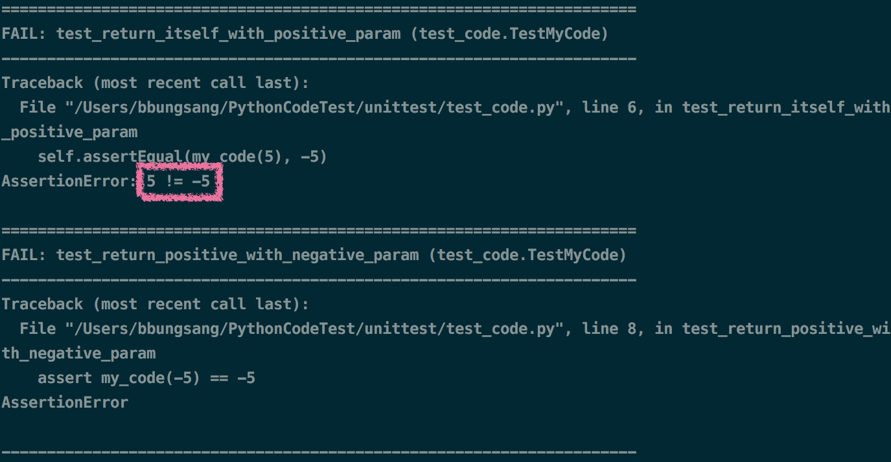
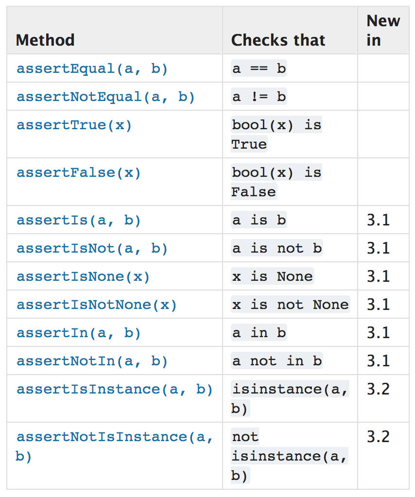
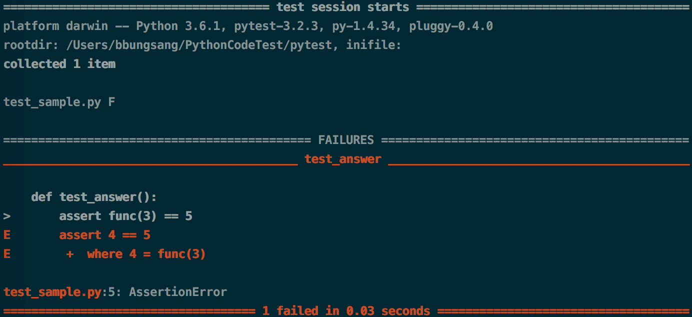

## 파이썬 기본 라이브러리 unittest
Java의 junit을 기반으로 만들어졌으며, 다른 언어의 주요 단위 테스트 프레임워크와 비슷하다.

> #### 테스트 주요 용어 
테스트 그룹: `unittest.TesCase`를 상속 <br>
테스트 케이스: `test`로 시작하는 메소드 <br>
픽스쳐: `공통 자원` 공유 및 재사용 <br>
실행 명령어: `python -m unittest test_code.py`

**[테스트 할 코드]**

```python
def my_code(n):
    if n >= 0:
        return n
    else:
        return -n
```

**[테스트 케이스]**

```python
import unittest
from codes import my_code

class TestMyCode(unittest.TestCase):
    def test_return_positive_num(self):
        self.assertEqual(my_code(5), 5)
    def test_return_negative_num(self):
        sel.assertEqual(my_code(-5), 5)
        
# 둘 다 성공
```

### 테스트 에러와 일반 에러
테스트 에러는 self.assertAbc() 메서드를 사용한 것이다.

```python
class TestMyCode(unittest.TestCase):
    def test_return_positive_num(self):
        assert my_code(5) == -5
    def test_return_negative_num(self):
        sel.assertEqual(my_code(-5), -5)
```



### assert 메소드



### Unittest Fixture
클래스를 활용하여 공통 자원 공유 및 재사용

```python
class Test(unittest.TestCase):
    @classmethod
    def setUpClass(cls):
        cls._conn = createExpensiveObject()
        
    @classmethod
    def tearDownClass(cls):
        cls._conn.destroy()
        
    # -- Text 내 전체 테스트 실행 전후 --
        
    def setUp(self):
        self.common_widget = createWidget("the widget")
        
    def tearDown(self):
        self.common_widget.dispose()
        
    # -- 각 테스트 케이스 실행 전후 --
```


```python
class Setup_Class(TestCase):
    def setUp(self):
        self.user = MyUser.objects.create_user(
            username="test@test.com",
            password="test1234",
        )
        self.book = Book.objects.create(
            cover_img="http://bookthumb.phinf.naver.net/cover/102/909/10290989.jpg?type=m1&udate=20170721",
            title="Do it! 점프 투 파이썬 (이미 50만 명이 '점프 투 파이썬'으로 시작했다!)",
            author="박응용",
            #...        
        )
        BuyBookRegister.objects.create(
            buyer=self.user,
            book_info=self.book,
            used_price="10000",
            etc_requirements="테스트",
        )
        self.read_update_delete_url = reverse("book:buy_book_detail", kwargs={"buy_pk": "1"})
        #...
```

```python
class BuyBookViewTest(Setup_Class):
    def test_buy_book_detail(self):
        response = self.client.get(self.read_update_delete_url)
        self.assertEqual(response.status_code, 200)
        self.assertEqual(response.context['book'].book_info.isbn, "8997390910 9788997390915")
        self.assertEqual(response.context['book'].buyer.username, "test@test.com")
        self.assertEqual(response.context['book'].buyer.nickname, "test")
        self.assertEqual(response.context['book'].book_info.cover_img,
                         "http://bookthumb.phinf.naver.net/cover/102/909/10290989.jpg?type=m1&udate=20170721")
        self.assertEqual(response.context['book'].book_info.title, "Do it! 점프 투 파이썬 (이미 50만 명이 '점프 투 파이썬'으로 시작했다!)")
        #...
    #...
    # test_buy_book_detail 이외의 test_buy_book_list, test_buy_book_register 등의 테스트 메서드가 위 공통 자원을 사용
```

하지만 필요없는 자원도 모든 테스트 그룹이 공유하게 된다. 관리가 힘들어진다.

## Pytest
- 테스트에 필요한 boiler plate code(getter, setter와 같은 반복되지만 자주 쓰이는 코드)가 매우 적다.
- 빠르고, 테스트에 필요한 도구 및 기능을 모두 가지고 있으며 2007년 첫 커밋을 이후로 지금까지 꾸준히 커밋되고 있어 성숙하고 안전한 라이브러리이다.
- unittest.TestCase가 무엇인지 알 필요가 없고, 테스트를 실행시키기 위해 unittest.main() 을 호출할 필요도 없다. 
- 테스트를 반드시 클래스 단위로 작성할 필요없다.
- assert 명령어만으로 테스트가 가능함 JUnit legacy methods의 많은 이름을 알 필요가 없다.
- 자세한 실패 보고를 제공해준다.
- 유용한 다양한 플러그인을 제공해준다.

### 설치와 실행

```
# 설치
>>> pip install pytest

# 실행
>>> python -m pytest
```

### 예시(코드 + 테스트 케이스)

```python
def func(x):
    return x + 1
    
def test_answer():
    assert func(3) == 5
```



## Pytest의 Fixture
pytest도 자원을 재사용할 경우 Fixture를 사용한다.

- 함수 형태
- 테스트 케이스에서 필요로 하는 fixture를 선택적으로 쉽게 사용
- 테스트의 독립성과 자원 재사용 사이의 조화를 찾는 한 방편
- @pytest.fixture 데코레이터를 사용한 함수가 바로 pytest fixture

```python
import pytest

@pytest.fixture
def smtp():
    import smtplib
    return smtplib.SMTP("smtp.gmail.com", 587, timeout=5)
    
def test_ehlo(smtp):
    response, msg = smtp.ehlo()
    assert response == 250
    assert 0
    
def test_ehlo2(smtp):
    # smtp 재사용    
```

- smtp 서버가 필요할 경우 이를 픽스쳐로 만들고 해당 smtp 픽스쳐를 인자 형태로 호출할 수 있다.
- 픽스쳐를 모듈화하고 필요할 때에만 호출하는 형식으로 테스트 그룹에 필요없는 자원을 공유하지 않아도 된다.

## django.test.TestCase

```
TestCase >>> TransactionTestCase >>> SimpleTestCase >>> unittest.TestCase
```

## 참고자료
- [[파이콘 2017] 파이썬에서 편하게 테스트 케이스 작성하기: pytest, Travis CI, 그리고 도커]()
- [파이썬3 공식 문서, 라이브러리 unittest](https://docs.python.org/3/library/unittest.html)
- [pytest 공식 문서](https://docs.pytest.org/en/latest/contents.html
)